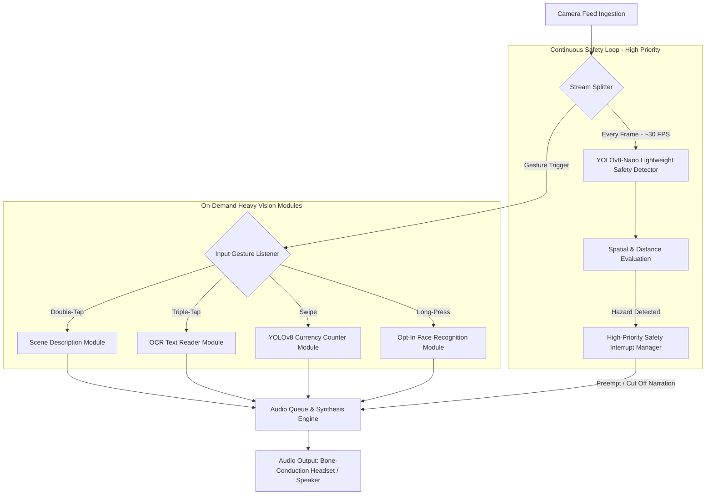

# Architecture & System Design — AUDIVUE

---

## 1. System Overview

**AUDIVUE** is designed as a hybrid real-time edge architecture that balances **safety-critical continuous monitoring** with **on-demand deep visual analysis**. To run efficiently on mobile hardware without overheating or dropping frames, AUDIVUE splits processing into a lightweight continuous safety loop and heavier demand-driven vision modules.



---

## 2. App Flow (User's Perspective)

### 🚀 1. App Launch & Booting
- **Default Mode:** Upon launch, the app boots directly into **"Walk Mode"** (Obstacle & Safety Detection Active).
- **Audio Feedback on Boot:** Speaks a short status line immediately:
  > *"Ready. Obstacle detection on."*

### 🛡️ 2. Continuous Background Safety Pass
- **Always-On Frame Ingestion:** A ultra-lightweight detector (`yolov8n`) processes nearly every video frame purely for safety.
- **Monitored Hazards:** Low & mid/high obstacles, curbs, drop-offs, stairs, vehicles, and people walking directly into the user's path.
- **Zero Touch Required:** Operates continuously without requiring user prompts or screen interaction.

### 🖐️ 3. On-Demand Heavy Modules (Gesture Triggers)
Because deeper models (OCR, multi-note currency summation, scene description) are compute-heavy, they are loaded on-demand via simple, intuitive touch/voice gestures:

| Gesture | Mode | Spoken Trigger / Action | Model Engine |
| :--- | :--- | :--- | :--- |
| **Double-Tap** | **Scene Description** | *"What's around me?"* | Fast Scene Classifier / ViT |
| **Triple-Tap** | **OCR Reading** | *"Read this"* | Text Detection + OCR (PaddleOCR / EasyOCR) |
| **Swipe** | **Currency Counter** | *"Count my money"* | Fine-Tuned Indian Currency YOLOv8 Model |
| **Long-Press** | **Face Recognition** | *"Toggle face recognition"* *(Opt-In Only)* | Facial Embeddings (ArcFace / MediaPipe) |

### ⚠️ 4. High-Priority Safety Interrupt System
- **Preemptive Audio Overriding:** Safety alerts **always** take maximum priority over ongoing narration.
- **Behavior:** If a close obstacle or imminent hazard is detected mid-sentence while reading text or describing a scene, the app **instantly cuts off current narration** and issues the safety warning immediately.
  > **Example:** While reading a book (*"Chapter 1: The journey..."*) $\rightarrow$ **INTERRUPTED** $\rightarrow$ *"Warning! Step down ahead, 2 feet."*

### 🎧 5. Audio Output Routing
- **Ambient Awareness First:** Audio is routed specifically through **Bone-Conduction Headsets** or the device's main speaker.
- **Ear Canal Preservation:** By avoiding in-ear headphones, the user's ear canal remains unobstructed to hear crucial environmental ambient sounds (traffic, voices, sirens).

---

## 3. Tech Stack

| Layer | Technology / Library | Purpose |
| :--- | :--- | :--- |
| **Mobile / Core App Framework** | React Native / Flutter / Python (FastAPI + WebRTC) | Cross-platform UI, camera stream binding, gesture handling |
| **Continuous Safety Vision** | PyTorch, Ultralytics YOLOv8-Nano (`yolov8n`) | Lightweight 30 FPS obstacle & hazard detection |
| **Currency Detection & Summation** | Custom Fine-Tuned YOLOv8 Currency Model | Multi-note recognition (₹10 to ₹2000) & instant summation |
| **OCR Text Extraction** | EasyOCR / PaddleOCR / Tesseract | Real-time text reading for signs, labels, documents |
| **Face Recognition (Opt-In)** | MediaPipe Face Mesh / ArcFace | Opt-in facial recognition for familiar contacts |
| **Edge Optimization** | ONNX Runtime Mobile / TFLite | Low-latency, offline edge inference on mobile NPU/GPU |
| **Gesture & Touch Input** | Native Gesture Handler | Multi-tap, swipe, and long-press event listeners |
| **Text-to-Speech (TTS)** | Native OS Speech Synthesis / `pyttsx3` | Low-latency voice output engine |
| **Audio Priority Queue** | Custom Async Priority Queue (`PriorityQueue`) | Manages safety interrupt overrides over regular narration |
| **Audio Routing Engine** | Native Audio Session Manager | Directs audio output to Bone-Conduction Headset / Speaker |

---

## 4. Folder & File Structure

```
AUDIVUE/
├── README.md
├── PRD.md
├── RULES.md
├── Architecture.md
├── assets/
│   └── logo.png
├── config/
│   ├── settings.py           # App configuration, thresholds & audio speeds
│   └── classes.py            # COCO & Currency denomination mappings
├── models/
│   ├── weights/
│   │   ├── yolov8n.pt        # Pretrained safety detector
│   │   └── currency_v8.pt    # Fine-tuned Indian currency model
│   └── model_loader.py       # Dynamic model loading & ONNX inference manager
├── src/
│   ├── main.py               # Main application entry point & boot sequence
│   ├── camera/
│   │   ├── stream.py         # OpenCV / WebRTC live frame ingestion
│   │   └── preprocessor.py   # Frame resizing, normalization & rotation
│   ├── pipelines/
│   │   ├── safety_loop.py    # Continuous high-frequency obstacle detection pass
│   │   ├── currency.py       # On-demand currency detection & summation engine
│   │   ├── ocr_reader.py     # On-demand OCR text extraction module
│   │   ├── scene_desc.py     # On-demand scene description module
│   │   └── face_rec.py       # Opt-in face recognition module
│   ├── gestures/
│   │   └── handler.py        # Listener for double-tap, triple-tap, swipe, long-press
│   ├── audio/
│   │   ├── tts_engine.py     # Local Text-to-Speech synthesizer
│   │   ├── priority_queue.py # Priority Queue with preemption for safety interrupts
│   │   └── router.py         # Audio routing manager (Bone-Conduction / Speaker)
│   └── utils/
│       ├── spatial_math.py   # Bounding box quadrant & proximity estimation
│       └── logger.py         # Telemetry & performance metric logger
└── tests/
    ├── test_safety_loop.py   # Automated tests for obstacle detection & safety interrupt
    └── test_currency.py      # Automated tests for multi-note summation logic
```
