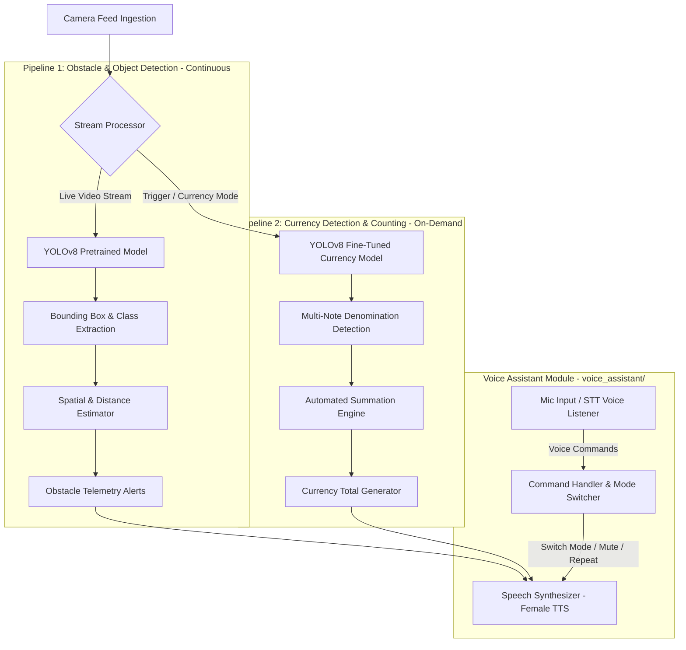

# Architecture & System Design — AUDIVUE

---

## 1. System Overview

**AUDIVUE** is engineered around a high-performance dual-pipeline computer vision architecture coupled with a browser-native Voice Assistant Module:
1. **Pipeline 1 (Obstacle & Object Detection):** Runs continuously on live frames to identify physical hazards, spatial quadrants, and distance proximity.
2. **Pipeline 2 (Currency Detection & Counting):** Triggered on-demand to perform multi-note recognition and automatically compute the total monetary sum.
3. **Voice Assistant Module (`voice_assistant/`):** Manages Text-to-Speech (TTS) using top-rated natural female voices, priority queueing with safety interrupts, and hands-free Speech-to-Text (STT) voice commands.



---

## 2. Voice Assistant Module Architecture

Located in `voice_assistant/`, the Voice Assistant handles hands-free speech interaction:

### 🔊 1. Top-Rated Female Voice Picker & TTS Engine
- **Voice Selection:** Automatically selects top-rated natural female English voices (e.g., Google US English Female, MS Jenny/Zira, Apple Samantha).
- **Priority Queueing & Interrupts:**
  - Normal alerts (e.g. general object descriptions) are queued smoothly.
  - Critical obstacle alerts (e.g., *"Warning! Obstacle directly ahead, close!"*) immediately interrupt ongoing speech (`speechSynthesis.cancel()`).

### 🎙️ 2. Speech-to-Text (STT) Voice Command Recognition
- **Supported Voice Commands:**
  - `"obstacle mode"` / `"walk mode"` $\rightarrow$ Switches active pipeline to Obstacle Detection.
  - `"currency mode"` / `"count money"` $\rightarrow$ Switches active pipeline to Currency Counting.
  - `"repeat"` $\rightarrow$ Repeats the last spoken alert.
  - `"stop"` / `"mute"` $\rightarrow$ Immediately stops active speech output.
  - `"status"` $\rightarrow$ Speaks current system mode and selected voice.

---

## 3. Tech Stack

| Layer | Technology | Purpose |
| :--- | :--- | :--- |
| **Voice Assistant Module** | Web Speech API (`SpeechSynthesis` & `SpeechRecognition`) | Top-rated female TTS output, priority interrupts, and voice control |
| **Obstacle Detection CV Model** | PyTorch, Ultralytics YOLOv8 (`yolov8n.pt`) | Real-time object & hazard detection |
| **Currency Detection CV Model** | Custom Fine-Tuned YOLOv8 (`currency_v8.pt`) | Multi-note denomination identification |
| **Summation Engine** | Python NumPy / Aggregator | Automated currency calculation |
| **Spatial Math Module** | Custom Bounding Box Analyzer | Calculates spatial quadrants (*left/right/center*) and distance proximity |

---

## 4. Folder & File Structure

```
AUDIVUE/
├── README.md
├── PRD.md
├── RULES.md
├── Architecture.md
├── assets/
│   └── logo.png
├── voice_assistant/               # Dedicated Voice Assistant Module
│   ├── voice_assistant.js         # Core Voice Assistant Class (TTS + STT + Female Voice Picker)
│   └── index.html                 # Interactive Web Test & Verification Page
├── config/
│   ├── settings.py                # Configuration settings & detection thresholds
│   └── classes.py                 # COCO & Currency denomination mappings
├── models/
│   ├── weights/
│   │   ├── yolov8n.pt             # Pretrained obstacle detection weights
│   │   └── currency_v8.pt         # Fine-tuned Indian currency weights
│   └── model_loader.py            # YOLOv8 model loading & inference manager
├── src/
│   ├── main.py                    # Main application entry point
│   ├── camera/
│   │   ├── stream.py              # Camera stream capture module
│   │   └── preprocessor.py        # Frame resizing & normalization
│   ├── pipelines/
│   │   ├── obstacle_detection.py  # Pipeline 1: Obstacle & object detection
│   │   └── currency_detection.py  # Pipeline 2: Currency detection & summation
│   └── utils/
│       ├── spatial_math.py        # Spatial quadrant & distance calculation
│       └── logger.py              # Telemetry & metric logger
└── tests/
    ├── test_obstacle_detection.py # Tests for obstacle detection pipeline
    └── test_currency_detection.py # Tests for currency detection & summation
```
