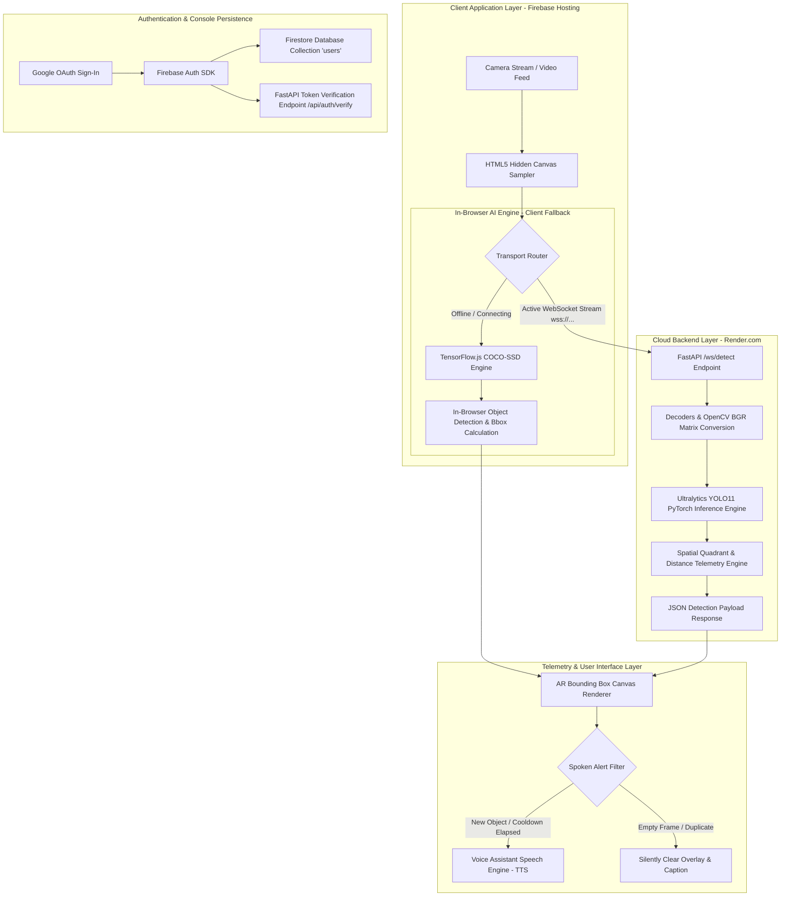

# Architecture & System Design — AUDIVUE

---

## 1. Executive Summary

**AUDIVUE** is an accessible, real-time Computer Vision application engineered to assist visually impaired individuals in spatial navigation and daily monetary transactions.

The system combines:
1. **Low-Latency Binary WebSocket Vision Stream:** FastAPI + Uvicorn server running Ultralytics YOLO11 (PyTorch) for server-side object and currency detection.
2. **In-Browser Client AI Engine:** Integrated TensorFlow.js COCO-SSD running directly inside the client browser for zero-downtime, offline-capable fallback inference.
3. **Spatial Quadrant & Distance Telemetry:** Bounding box spatial analysis dividing the camera frame into 3 Horizontal Quadrants (`Left`, `Center`, `Right`) and 3 Distance Proximity Zones (`Close`, `Medium`, `Far`).
4. **Firebase Authentication & Console Persistence:** Google OAuth authentication synced with Firebase Firestore Database collection `users/{uid}` under project `audivue-258930`.
5. **Web Voice Assistant Engine:** Priority-queued Web Speech Text-to-Speech (TTS) synthesis with smart deduplication and 8-second speech cooldowns.

---

## 2. End-to-End System Dataflow



---

## 3. Core Technical Modules

### 3.1 Binary WebSocket Streamer (`main.py` -> `/ws/detect`)
- **Transport Format:** Raw binary JPEG bytes sent over WebSockets at 12–15 FPS.
- **Decoding:** Decoded asynchronously off the main ASGI loop via `cv2.imdecode` and `asyncio.to_thread`.
- **Inference Execution:** Runs Ultralytics YOLO11 (`yolo11n.pt` / `yolo11x.pt`) yielding class IDs, confidence scores, and bounding box percentages.

### 3.2 Spatial Telemetry & Quadrant Calculator
Given bounding box normalized coordinates $(x, y, w, h)$:
$$\text{Center}_X = x + \frac{w}{2}, \quad \text{Area}_{\%} = w \times h$$

- **Spatial Quadrant Mapping:**
  - $\text{Center}_X < 0.38 \implies \textbf{Left Quadrant}$
  - $0.38 \le \text{Center}_X \le 0.62 \implies \textbf{Center Quadrant}$
  - $\text{Center}_X > 0.62 \implies \textbf{Right Quadrant}$
- **Distance Proximity Estimation:**
  - $\text{Area}_{\%} > 0.12 \implies \textbf{Close Proximity}$ (Triggers critical alert highlight)
  - $0.03 \le \text{Area}_{\%} \le 0.12 \implies \textbf{Medium Proximity}$
  - $\text{Area}_{\%} < 0.03 \implies \textbf{Far Proximity}$

### 3.3 Firebase Authentication & Data Sync (`assets/firebase_auth.js`)
- Authenticates users via Google OAuth Provider.
- Saves/upserts JSON profile document to Firestore Database:
  ```json
  {
    "uid": "google_user_uid",
    "displayName": "User Name",
    "email": "user@gmail.com",
    "photoURL": "https://lh3.googleusercontent.com/...",
    "lastLoginAt": "2026-08-23T05:00:00Z",
    "providerId": "google.com",
    "app": "AUDIVUE AI Vision Assistant"
  }
  ```

---

## 4. Technology Stack Matrix

| Module | Component | Technology |
| :--- | :--- | :--- |
| **Frontend UI** | Client Interface | HTML5, CSS3 Glassmorphism, JavaScript ES6 |
| **Client AI** | In-Browser Engine | TensorFlow.js, COCO-SSD (`@tensorflow-models/coco-ssd`) |
| **Backend Server** | ASGI Server | FastAPI 0.100+, Uvicorn 0.22+ |
| **Vision Model** | Object Detection | PyTorch, Ultralytics YOLO11 (v8.3+) |
| **Auth & DB** | User Management | Firebase Auth & Firestore Console (`audivue-258930`) |
| **Voice Engine** | Speech Synthesis | Web Speech API (`SpeechSynthesisUtterance`) |
| **Hosting** | CDN & Cloud Server | Firebase Hosting (`web.app`) & Render.com |

---

## 5. Deployment Topology

- **Frontend Application:** Deployed to **Firebase Hosting** CDN:
  - Domain: `https://audivue-258930.web.app`
- **Backend Service:** Deployed to **Render.com Cloud Python ASGI Service**:
  - Domain: `https://audivue-backend-kray.onrender.com`
  - WebSocket: `wss://audivue-backend-kray.onrender.com/ws/detect`
