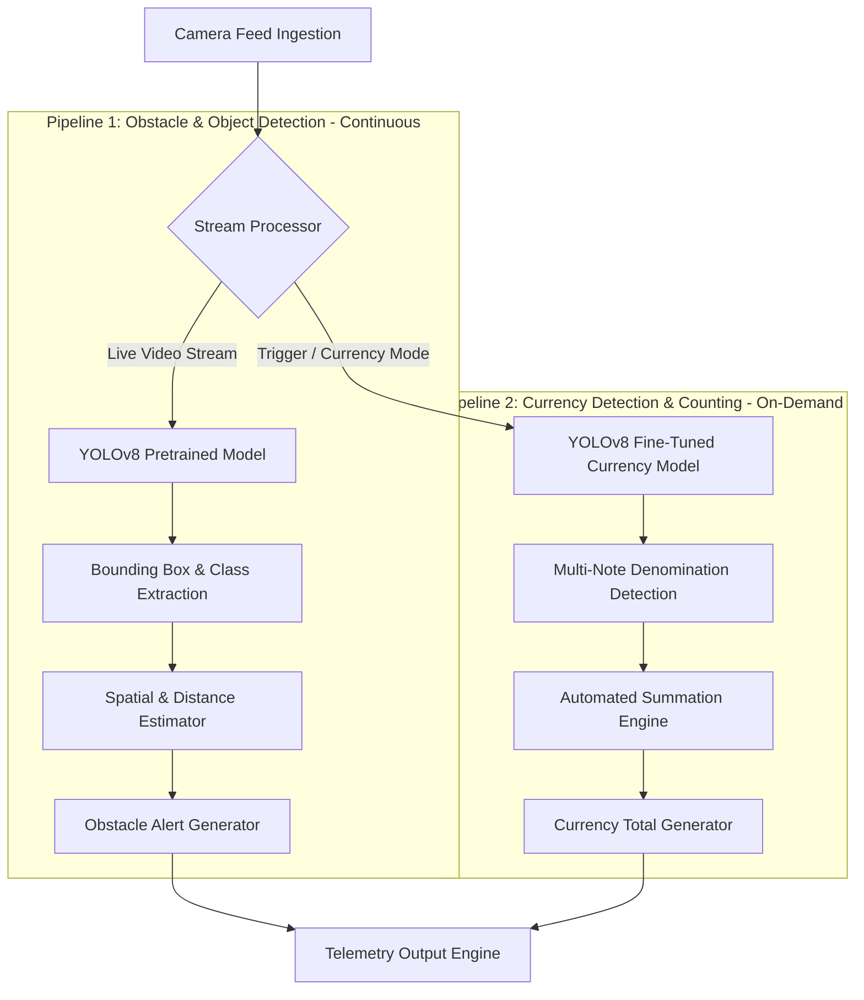

# Architecture & System Design — AUDIVUE

---

## 1. System Overview

**AUDIVUE** is engineered around a high-performance dual-pipeline computer vision architecture:
1. **Pipeline 1 (Obstacle & Object Detection):** Runs continuously on live frames to identify physical hazards, spatial quadrants, and distance proximity.
2. **Pipeline 2 (Currency Detection & Counting):** Triggered on-demand to perform multi-note recognition and automatically compute the total monetary sum.



---

## 2. System Flow

### 🛡️ Pipeline 1: Obstacle & Object Detection
- **Continuous Ingestion:** Processes live camera frames in real time.
- **Detector:** Pretrained YOLOv8 model for general object and obstacle classes (people, chairs, doors, stairs, vehicles, obstacles).
- **Spatial Evaluation:** Classifies object positions into spatial quadrants (*left, center, right*) and proximity bands (*close, medium, far*).

### 💵 Pipeline 2: Currency Detection & Counting
- **On-Demand Mode:** Activated when currency recognition is triggered.
- **Detector:** Fine-tuned YOLOv8 model specialized on Indian currency notes (₹10, ₹20, ₹50, ₹100, ₹200, ₹500, ₹2000).
- **Summation Engine:** Identifies every note visible in the frame, extracts individual values, and calculates the total monetary sum ($\text{Total} = \sum \text{denominations}$).

---

## 3. Tech Stack

| Layer | Technology | Purpose |
| :--- | :--- | :--- |
| **Core Framework** | Python 3.10+ / OpenCV | Frame ingestion, image preprocessing, and stream management |
| **Obstacle Detection CV Model** | PyTorch, Ultralytics YOLOv8 (`yolov8n.pt`) | Real-time object & hazard detection |
| **Currency Detection CV Model** | Custom Fine-Tuned YOLOv8 (`currency_v8.pt`) | Multi-note denomination identification |
| **Summation Engine** | Python NumPy / Aggregator | Automated currency calculation |
| **Spatial Math Module** | Custom Bounding Box Analyzer | Calculates spatial quadrants (*left/right/center*) and distance proximity |

---

## 4. Folder & File Structure

```
AUDIVUE/
├── README.md
├── PRD.md
├── RULES.md
├── Architecture.md
├── assets/
│   └── logo.png
├── config/
│   ├── settings.py                # Configuration settings & detection thresholds
│   └── classes.py                 # COCO & Currency denomination mappings
├── models/
│   ├── weights/
│   │   ├── yolov8n.pt             # Pretrained obstacle detection weights
│   │   └── currency_v8.pt         # Fine-tuned Indian currency weights
│   └── model_loader.py            # YOLOv8 model loading & inference manager
├── src/
│   ├── main.py                    # Main application entry point
│   ├── camera/
│   │   ├── stream.py              # Camera stream capture module
│   │   └── preprocessor.py        # Frame resizing & normalization
│   ├── pipelines/
│   │   ├── obstacle_detection.py  # Pipeline 1: Obstacle & object detection
│   │   └── currency_detection.py  # Pipeline 2: Currency detection & summation
│   └── utils/
│       ├── spatial_math.py        # Spatial quadrant & distance calculation
│       └── logger.py              # Telemetry & metric logger
└── tests/
    ├── test_obstacle_detection.py # Tests for obstacle detection pipeline
    └── test_currency_detection.py # Tests for currency detection & summation
```
