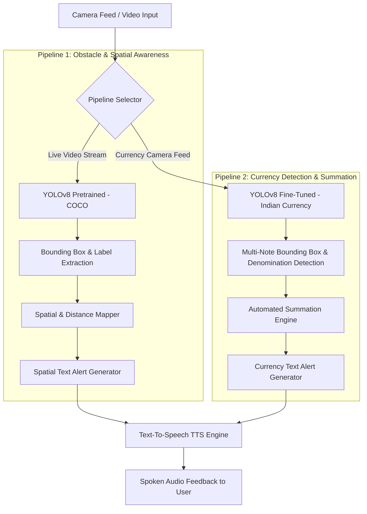

# Product Requirement Document (PRD) — AUDIVUE
**Real-Time AI Vision & Currency Assistant for the Visually Impaired**

---

## 1. Project Overview & Elevator Pitch

- **Project Name:** AUDIVUE
- **Track:** Track 03 // Computer Vision
- **Target Audience:** Visually impaired & blind individuals, caregivers, schools for the blind, NGOs
- **Core Pitch:** *AUDIVUE is an edge-capable real-time AI vision assistant that transforms smartphone camera feeds into precise audio spatial alerts and automated currency calculations—giving visually impaired users instant environmental awareness and financial independence.*

---

## 2. Problem Statement

Over 2.2 billion people worldwide live with vision impairment or blindness (WHO). In daily life, visually impaired individuals encounter three critical hurdles:
1. **Obstacle Navigation:** Traditional mobility aids (canes, guide dogs) assist with low-level ground obstacles but offer zero information regarding mid-to-high level obstacles (e.g., hanging branches, open cabinet doors, chairs, upcoming doors, vehicles).
2. **Environmental & Spatial Awareness:** Inability to identify objects, people, or hazards around them in unfamiliar environments.
3. **Currency Identification & Counting:** Identifying and counting paper currency notes in real time. Existing assistive tools fail at multi-note recognition and automatic total summation, creating vulnerability in financial transactions.

---

## 3. Hackathon Track Compliance Matrix (Track 03 — Computer Vision)

AUDIVUE strictly fulfills all compulsory requirements defined in **Track 03 // Computer Vision**:

| Hackathon System Requirement | AUDIVUE Implementation | Compliance Status |
| :--- | :--- | :---: |
| **1. Input Stream** Must process image or video input | Live smartphone / webcam camera feed processed frame-by-frame via OpenCV stream. | ✅ Pass |
| **2. Vision Pipeline** Must use a real CV architecture (CNN, YOLO, ResNet, ViT) — *No black-box API calls as the primary vision pipeline* | Uses **YOLOv8** local models (PyTorch / Ultralytics) for real-time object and currency detection. | ✅ Pass |
| **3. Automated Understanding** Must perform object detection, classification, segmentation, or OCR | Real-time 2D Object Detection & Multiclass Classification (COCO classes + Indian Currency Denominations). | ✅ Pass |
| **4. Measurable Output** Must produce bounding boxes, labels, masks, or extracted text — *Quantifiable output, not just a text summary* | Generates exact bounding box coordinates $(x, y, w, h)$, class confidence scores, object count, spatial positioning matrix, and calculated currency total value ($\sum \text{denominations}$). | ✅ Pass |

---

## 4. System Architecture & Pipelines

AUDIVUE runs two specialized CV detection pipelines feeding into a unified spatial audio output engine.

### Pipeline 1: Obstacle & Spatial Awareness
- **Model Architecture:** YOLOv8 (Pretrained on COCO dataset — 80 classes including people, chairs, doors, vehicles, stairs, bicycles).
- **Processing Logic:**
  1. Frames captured from live input stream.
  2. YOLOv8 predicts bounding boxes $(x_{min}, y_{min}, x_{max}, y_{max})$ and confidence scores.
  3. Frame relative center coordinates determine spatial orientation: `Left`, `Center`, `Right`.
  4. Bounding box area ratio determines proximity estimate: `Close`, `Medium`, `Far`.
- **Measurable Output:** Class labels, bounding box coordinates, spatial quadrant, distance vector.
- **Example Audio Prompt:** *"Chair ahead, slightly left, close."*

### Pipeline 2: Currency Detection & Counting
- **Model Architecture:** YOLOv8 custom fine-tuned on Indian Currency Dataset (Denominations: ₹10, ₹20, ₹50, ₹100, ₹200, ₹500, ₹2000).
- **Processing Logic:**
  1. Detects all currency notes in frame simultaneously.
  2. Maps bounding box labels to numerical value representations.
  3. Computes instantaneous aggregate total: $\text{Total} = \sum_{i=1}^{N} \text{Note}_i$.
- **Measurable Output:** Multi-note bounding box telemetry, individual note denomination labels, calculated integer total.
- **Example Audio Prompt:** *"500, 200, and 100 rupees detected — total 800 rupees."*

---

## 5. Technology Stack

- **Computer Vision Framework:** PyTorch, Ultralytics YOLOv8, OpenCV
- **Language:** Python 3.10+ / JavaScript (WebRTC integration)
- **Audio Output (TTS):** `pyttsx3` / `gTTS` / Web Speech API (low-latency audio feedback)
- **User Interface:** Streamlit / Web Application / Mobile Camera Web UI

---

## 6. Functional Requirements

### FR-1: Real-Time Stream Ingestion
- System must ingest minimum 15 FPS video feed from default camera/webcam.

### FR-2: Object & Obstacle Detection
- System must detect objects with confidence $\ge 0.50$.
- System must output spatial position (left/center/right) and estimated distance (near/far).

### FR-3: Currency Detection & Summation
- System must recognize multiple overlapping/adjacent currency notes in a single view.
- System must accurately calculate and output the exact monetary sum.

### FR-4: Hands-Free Spoken Feedback
- System must convert detection telemetry directly to speech without requiring screen interactions.
- Audio queueing must prioritize high-risk obstacle alerts over non-critical background object descriptions.

---

## 7. Non-Functional Requirements

- **Latency:** End-to-end latency from frame capture to audio alert initiation must be $< 800\text{ms}$.
- **Accuracy:** Currency denomination detection accuracy target $\ge 90\%$ under standard indoor lighting.
- **Offline Capability:** Core CV inference (YOLOv8) and TTS engine must run locally on-device without requiring internet connectivity.

---

## 8. Success Metrics & Verification Plan

| Metric | Target | Verification Method |
| :--- | :--- | :--- |
| Bounding Box Detection Precision | $\ge 85\% \text{ mAP@50}$ | Evaluate on test image dataset using standard IoU metrics. |
| Currency Calculation Accuracy | $100\%$ sum correctness on detected notes | Test suite of multi-note arrangements. |
| Pipeline Latency | $< 1 \text{ second}$ per audio response | System timestamp logging between frame capture & audio dispatch. |
| Track Compliance | $100\%$ adherence | Empirical demonstration showing raw bounding boxes & real CV model pipeline. |

---

## 9. Future Roadmap & Extensions

1. **Wearable Integration:** Deploying lightweight quantized model (YOLOv8-nano / ONNX) onto smart glasses / Raspberry Pi Zero / mobile edge devices.
2. **OCR & Signage Reading:** Integration of lightweight OCR pipeline (e.g., Tesseract / PaddleOCR) for reading street signs, product labels, and medication bottles.
3. **Multi-Currency Expansion:** Support for USD, EUR, GBP, and additional regional currencies.
