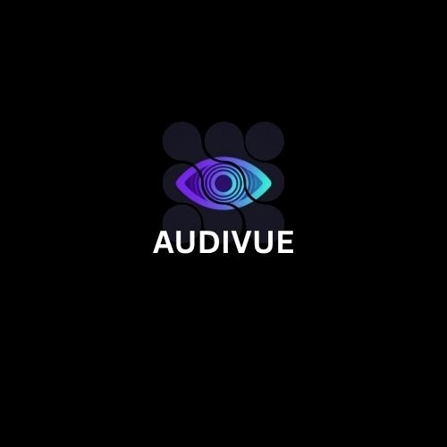

<p align="center">
  
</p>

<h1 align="center">AUDIVUE</h1>
<p align="center">
  <b>Real-Time AI Vision & Currency Assistant for the Visually Impaired</b><br>
  <i>Transforming Live Camera Feeds into Real-Time Spatial Intelligence, Automated Currency Calculations, and Hands-Free Voice Guidance</i>
</p>

<p align="center">
  <a href="#problem-statement">Problem Statement</a> •
  <a href="#our-solution">Our Solution</a> •
  <a href="#dual-pipeline-architecture">Architecture</a> •
  <a href="#voice-assistant">Voice Assistant</a> •
  <a href="#track-03-compliance">Track 03 Compliance</a> •
  <a href="#repository-docs">Documentation</a>
</p>

---

## 📌 Problem Statement

Over **2.2 billion people worldwide** live with vision impairment or blindness ([World Health Organization](https://www.who.int/news-room/fact-sheets/detail/blindness-and-visual-impairment)). In their everyday lives, visually impaired individuals face severe hurdles across three critical tasks:

1. **Detecting Obstacles Safely While Walking:** Traditional mobility aids like white canes and guide dogs assist with ground-level hazards, but provide zero information regarding mid-to-high level obstacles (e.g., hanging branches, open cabinet doors, approaching doors, vehicles, or low overhead barriers).
2. **Recognizing Objects and People:** Navigating unfamiliar indoor or outdoor spaces without visual context limits awareness of surrounding objects, people, or potential spatial hazards.
3. **Identifying and Counting Currency Notes:** Independent financial transactions remain an unresolved challenge. Visually impaired individuals struggle to differentiate paper currency notes rapidly, and there is currently no reliable, accessible tool that performs multi-note recognition and automatically calculates the total monetary sum.

> **The Impact:** This information gap restricts mobility, creates safety risks, and reduces personal independence and confidence in everyday life.

---

## 💡 Our Solution

**AUDIVUE** is a real-time AI Vision Assistant designed to run on smartphone camera feeds or webcams. It uses local computer vision models to "see" the world on the user's behalf and translates visual observations into immediate spoken audio alerts and hands-free voice commands — powered by our dedicated **Web Voice Assistant Module**.

---

## ⚙️ Dual-Pipeline Architecture

AUDIVUE runs two focused, high-performance vision pipelines:

```
Camera Feed ──► CV Model (YOLOv8) ──► Telemetry / Spatial Detection Alerts ──► Web Voice Assistant
```

### 1️⃣ Pipeline 1: Obstacle & Object Awareness
- **Input:** Live camera feed.
- **CV Architecture:** YOLOv8 (pretrained on the COCO dataset — detecting people, chairs, doors, stairs, vehicles, etc.).
- **Detection & Spatial Mapping:** Identifies objects and maps their relative spatial position (`Left`, `Center`, `Right`) and distance proximity (`Close`, `Medium`, `Far`).
- **Output:** Spatial telemetry alerts (*"Chair ahead, slightly left, close"*).

### 2️⃣ Pipeline 2: Currency Detection & Counting
- **Input:** Live camera feed focused on currency notes.
- **CV Architecture:** YOLOv8 fine-tuned on Indian Currency dataset (denominated from ₹10 to ₹2000).
- **Detection & Calculation:** Detects all notes in frame simultaneously, extracts individual values, and automatically computes the total monetary sum ($\sum \text{notes}$).
- **Output:** Aggregate detection summary (*"500, 200, and 100 rupees detected — total 800 rupees"*).

---

## 🎙️ Web Voice Assistant Module (`voice_assistant/`)

Located in the [`voice_assistant/`](voice_assistant/) directory:
- **Top-Rated Female Voice Synthesis:** Prefers natural high-quality female voices (Google US English Female, MS Jenny/Zira, Apple Samantha).
- **Priority Queue & Safety Interrupts:** Critical obstacle alerts instantly cut off lower-priority speech.
- **Hands-Free Speech-to-Text Commands:** Responds to spoken commands (*"obstacle mode"*, *"count money"*, *"status"*, *"stop"*, *"repeat"*).
- **Interactive Test Page:** Try the live demonstration at [`voice_assistant/index.html`](voice_assistant/index.html).

---

## 🎯 Track 03 // Computer Vision Compliance Matrix

AUDIVUE is built in strict adherence to **Track 03 // Computer Vision** hackathon requirements:

| Track 03 System Requirement | AUDIVUE Implementation | Compliance |
| :--- | :--- | :---: |
| **Input Stream** | Frame-by-frame processing of live video/image streams. | ✅ Pass |
| **Vision Pipeline** | Real CV architecture (**YOLOv8** local inference — zero black-box vision APIs). | ✅ Pass |
| **Automated Understanding** | Real-time object detection, spatial mapping, and multi-class currency classification. | ✅ Pass |
| **Measurable Output** | Generates bounding box coordinates $(x, y, w, h)$, class labels, confidence scores, and computed currency sums. | ✅ Pass |

---

## 📄 Repository Documentation

- [📋 Product Requirement Document (PRD.md)](PRD.md) — What to build, target users, and detailed features.
- [📏 Technical Rules & Guidelines (RULES.md)](RULES.md) — What to use and what to avoid during development.
- [🏗️ System Architecture (Architecture.md)](Architecture.md) — System architecture, dual pipelines, voice assistant, tech stack, and file structure.

---

<p align="center">
  <i>Developed for Track 03 // Computer Vision Hackathon</i>
</p>